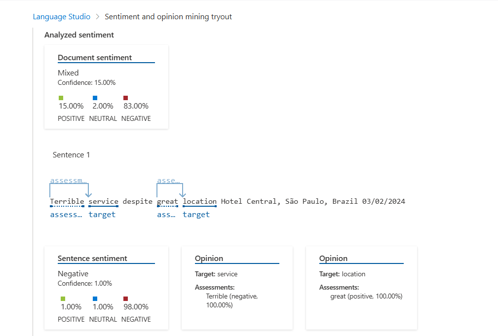

  ---
  #  Projeto: Análise de Sentimentos com Azure Cognitive Services

  Este projeto foi desenvolvido como parte da formação da DIO, com o objetivo de aplicar os conhecimentos em IA e Serviços Cognitivos da Microsoft Azure para análise de sentimentos em diferentes tipos de conteúdo.
  ---

  ##  Análise de Texto - Review de Hotel

  **Arquivo:** `inputs/review-hotel.txt`

  **Conteúdo:**

  > The Royal Hotel, London. United Kingdom  
  > 5/6/2018  
  >
  > This is an old hotel (has been around since 1950s) and the room furnishings are average, becoming a bit old now and require changing.  
  > Internet didn't work and I had to come to one of their office rooms to check in for my flight home.  
  > The website says it's close to the British Museum, but it's too far to walk!

  ###  Resultado da Análise

  - **Sentimento predominante:** Negativo  
  - **Confiança:** Alta

  ####  Prints
  - Texto inserido:
    
  - Resultado da análise:
    

  ---

  ##  Análise de Sentimento - Áudio Transcrito

  **Arquivo:** `inputs/audio-noticia-transcricao.txt`  
  **Áudio original:** [`noticia-falando.mp3`](./audios/noticia-falando.mp3)

  ### Transcrição do Áudio

  > Morreu nesta quinta-feira a rainha britânica Elizabeth segunda. O anúncio de sua morte chega após os médicos particulares da monarca alertarem a família real, que imediatamente se deslocou para Escócia no castelo de Bauman, onde a monarca se hospedava durante os verões. Na presença de seu filho mais velho, o Príncipe Charles, e seu neto, Príncipe William, a morte da rainha é confirmada.

  ###  Resultado da Análise

  - **Sentimento predominante:** Neutro (com leve inclinação negativa)
  - **Motivo:** O texto é informativo e factual, com tema sensível.

  ####  Prints
  - Transcrição usada:
    

  ---

  ##  Aprendizados

- Entendi na prática como os Serviços Cognitivos do Azure vão além da teoria e têm aplicações reais no dia a dia.
- A conversão de fala em texto mostrou ser extremamente útil para **acessibilidade**, **educação** e **eventos ao vivo** com legendas automáticas.
- Percebi como a IA pode facilitar tarefas como **transcrição de aulas e vídeos**, além de permitir **análises automatizadas de atendimentos de call center**, incluindo sentimento, PII e resumos.
- O exercício reforçou o valor de integrar tecnologias invisíveis que realmente melhoram a **experiência humana** com eficiência e inteligência.

---

  ##  Possibilidades Futuras

  - Automatizar o envio de textos e áudios usando scripts Python.
  - Criar dashboards com gráficos para visualização em tempo real.
  - Usar com grandes volumes de dados para análise de reputação online.

 
  ---

